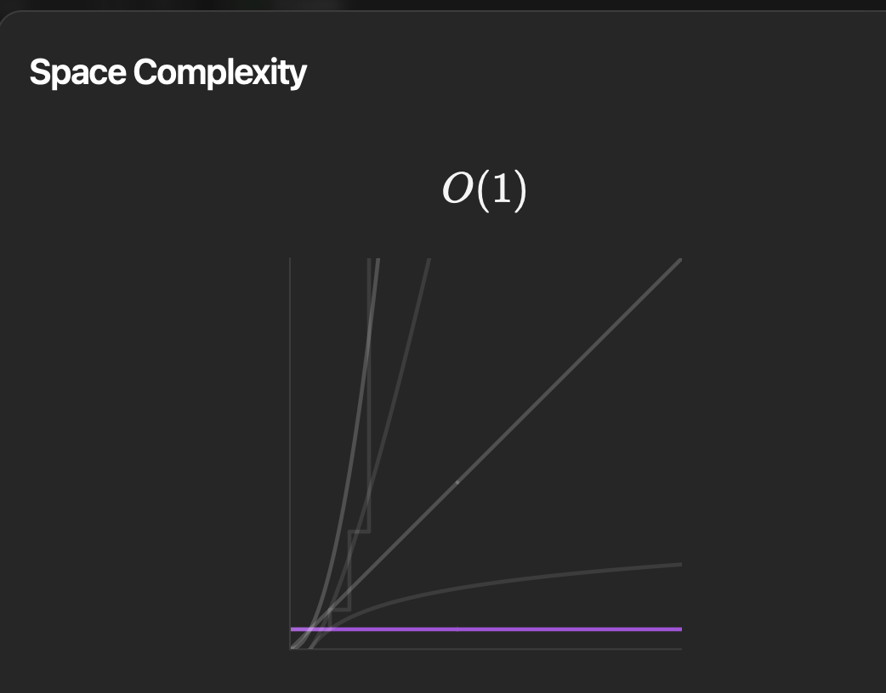
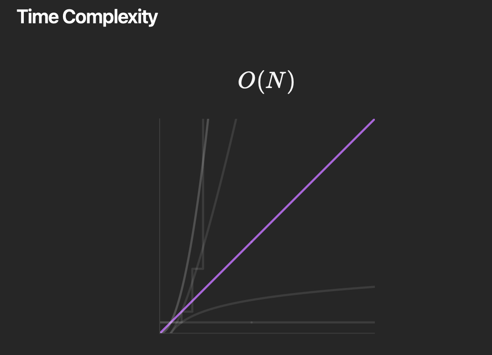

# Problem_Solving
## Grumpy Bookstore Owner (leetcode)

This problem revolves around a bookstore owner who is open for `n` minutes. During each minute, a certain number of customers enter the store. This is represented by the `customers` array, where `customers[i]` is the number of customers that enter the store at the start of the `i`th minute.

However, the bookstore owner can sometimes be grumpy. This is represented by the `grumpy` array, where `grumpy[i]` is `1` if the bookstore owner is grumpy during the `i`th minute, and `0` otherwise.

When the bookstore owner is grumpy, the customers of that minute are not satisfied. But when the owner is not grumpy, the customers are satisfied.

The bookstore owner has a secret technique that allows them to not be grumpy for `minutes` consecutive minutes, but they can only use this technique once.

The goal of the problem is to return the maximum number of customers that can be satisfied throughout the day. This involves figuring out the best time for the bookstore owner to use their technique to maximize customer satisfaction.

For example, if `customers = [1,0,1,2,1,1,7,5]`, `grumpy = [0,1,0,1,0,1,0,1]`, and `minutes = 3`, the bookstore owner should use their technique during the last 3 minutes to satisfy the maximum number of customers, which would be 16 in this case.

### Python Solution

The Python solution uses a sliding window approach. First, it calculates the total number of satisfied customers when the bookstore owner is not grumpy. Then, it subtracts these customers from the `customers` array. After that, it calculates the maximum number of customers that can be satisfied when the bookstore owner uses their technique. It uses a sliding window of size `minutes` to find the maximum sum in the `customers` array. The final result is the sum of the total number of satisfied customers when the bookstore owner is not grumpy and the maximum number of customers that can be satisfied when the bookstore owner uses their technique.
### Time and Space Complexity

The time complexity of the solution is O(n), where n is the length of the `customers` array. This is because we iterate over the `customers` array once.

The space complexity of the solution is O(1), as we only use a constant amount of space to store the total number of satisfied customers and the maximum number of customers that can be satisfied when the bookstore owner uses their technique.

### ----------------------------------------------
### ----------------------------------------------
# Count Number of Nice Subarrays

## Problem Statement

Given an array of integers `nums` and an integer `k`. A continuous subarray is called **nice** if there are `k` odd numbers on it. The goal is to return the number of **nice** sub-arrays.

## Constraints

- `1 <= nums.length <= 50000`
- `1 <= nums[i] <= 10^5`
- `1 <= k <= nums.length`

## Example

Input: `nums = [1,1,2,1,1], k = 3`

Output: `2`

Explanation: The only sub-arrays with 3 odd numbers are `[1,1,2,1]` and `[1,2,1,1]`.

## Solution

The problem can be solved using the concept of prefix sums and the principle of inclusion-exclusion. The prefix sum array can be used to keep track of the cumulative sum of odd numbers up to a certain index. The principle of inclusion-exclusion is used to count the number of subarrays that have exactly `k` odd numbers. This is done by counting the number of subarrays that have at most `k` odd numbers and subtracting the number of subarrays that have at most `k-1` odd numbers.

A hash table (or dictionary in Python) is used to store the frequency of prefix sums. The key in the hash table is the prefix sum (i.e., the number of odd numbers up to a certain index), and the value is the number of times this prefix sum occurs. This allows for constant time lookup and update operations, which can significantly speed up the solution.

## Time and Space Complexity

The time complexity of the solution is O(n), where n is the length of the `nums` array. This is because we iterate over the `nums` array once.

The space complexity of the solution is O(n), as we use a hash table to store the frequency of prefix sums.

## -----------------------------------------------
## -----------------------------------------------

# Minimum Number of K Consecutive Bit Flips

## Problem Statement

In an array `nums` with only binary digits, we need to flip one subarray of length `k` to change it into a `1`. The goal is to return the minimum number of flips required to convert the entire array into `1`s. If it's not possible to convert the array, return `-1`.

## Constraints

- `1 <= nums.length <= 30000`
- `1 <= k <= nums.length`
- `nums[i]` is either `0` or `1`.

## Example

Input: `nums = [0, 1, 0], k = 1`

Output: `2`

Explanation: We can flip the first bit to get `nums = [1, 1, 0]`, then flip the third bit to get `nums = [1, 1, 1]`.

## Solution

The problem can be solved using a greedy approach with a sliding window. We iterate over the array, and if we find a `0`, we flip the next `k` bits. If we reach a point where we need to flip but don't have `k` bits left, we return `-1`.

## Time and Space Complexity

The time complexity of the solution is O(n), where n is the length of the `nums` array. This is because we iterate over the `nums` array once.

The space complexity of the solution is O(n), as we use an additional array to keep track of the flips.

## ------------------------------------------------------
## ------------------------------------------------------

# 1038. Binary Search Tree to Greater Sum Tree

## Problem Statement

Given the root of a Binary Search Tree (BST), convert it to a Greater Tree such that every key of the original BST is changed to the original key plus sum of all keys greater than the original key in BST.

## Constraints

- The number of nodes in the tree is between 1 and 100.
- Each node will have value between 0 and 100.
- The given tree is a binary search tree.

## Example

Input: [4,1,6,0,2,5,7,null,null,null,3,null,null,null,8]

Output: [30,36,21,36,35,26,15,null,null,null,33,null,null,null,8]

## Solution

The solution uses a depth-first search (DFS) approach to solve the problem. The DFS function traverses the tree in reverse in-order (right -> root -> left), which ensures that we visit the nodes in descending order. 

A running total of the node values is maintained. For each node, its value is added to the running total, and then the node's value is replaced with the current total.

## Time and Space Complexity

The time complexity for this solution is O(n), where n is the number of nodes in the tree. This is because we visit each node exactly once.

The space complexity is O(h), where h is the height of the tree. This space is used for the call stack during the DFS traversal.

! [Space Complexity] (space_com_Binary_Search_Tree_to_Greater_Sum_Tree.png)
